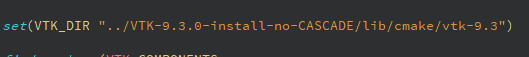
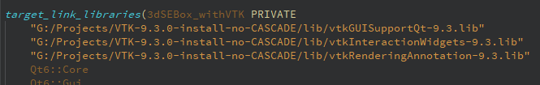
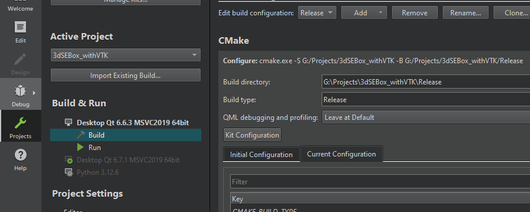

# Download
### Как?
- Иметь/скачать Qt Creator 6.6.0+
- Скачать файл с VTK (в тг) и разархивировать его
- git clone данный репозиторий
- После загрузки в CMakeLists.txt заменить данные на актуальный путь к VTK в вашей системе

- В меню *projects* добавить конфигурацию Release и указать к ней путь папка_с_проектом\Release

- Перекинуть все .dll файлы из VTK-9.3.0-install-no-CASCADE\bin в 3dSEBox_withVTK\Release
- Попробовать запустить программу

###### По всем вопросам писать либо в общий чат тг или мне в личку (*@FriendlyHoovy*)